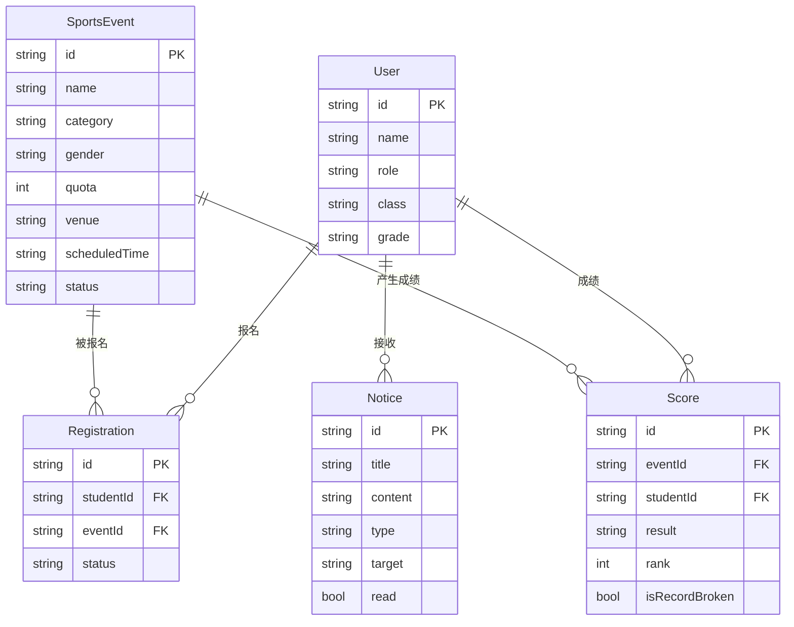

# 校园运动会管理系统 — 技术架构文档

## 1. 架构设计

本项目为纯前端单页应用（SPA），采用 mock 数据模拟后端，便于演示与后续接入真实后端。

```mermaid
flowchart TD
    subgraph "前端层 (Vue 3 SPA)"
        "路由层 Vue Router" --> "教师端视图"
        "路由层 Vue Router" --> "学生端视图"
        "教师端视图" --> "Pinia Store"
        "学生端视图" --> "Pinia Store"
        "Pinia Store" --> "API 封装层 axios"
    end
    subgraph "数据层"
        "API 封装层 axios" --> "Mock 数据层"
        "Mock 数据层" --> "localStorage 持久化"
    end
    subgraph "UI 层"
        "Element Plus 组件库" --> "教师端视图"
        "Element Plus 组件库" --> "学生端视图"
        "Tailwind CSS 原子化样式" --> "教师端视图"
        "Tailwind CSS 原子化样式" --> "学生端视图"
    end
```

## 2. 技术说明

- **前端框架**：Vue@3.4 + TypeScript@5.3 + Vite@5.0
- **状态管理**：Pinia@2.1（按模块拆分：auth、event、registration、score、notice）
- **路由**：Vue Router@4.2（按角色拆分 `/teacher/*` 与 `/student/*`，路由守卫做权限校验）
- **UI 组件库**：Element Plus@2.4（表格、表单、弹窗、消息提示）+ lucide-vue-next 图标
- **样式方案**：Tailwind CSS@3.4 + SCSS（主题变量统一定义在 `src/styles/variables.scss`）
- **HTTP**：axios@1.6（拦截器处理 token 与错误，开发期对接 mock）
- **图表**：ECharts@5.4（数据统计模块的柱状图/环形图/趋势图）
- **初始化工具**：`npm create vite@latest` 选择 vue-ts 模板
- **后端**：无（采用前端 mock + localStorage 持久化模拟数据）

## 3. 路由定义

| 路由 | 用途 | 权限 |
|------|------|------|
| `/login` | 统一登录页 | 公开 |
| `/teacher` | 教师端布局（侧边栏+主区） | 教师 |
| `/teacher/dashboard` | 教师工作台 | 教师 |
| `/teacher/events` | 赛事管理 | 教师 |
| `/teacher/approvals` | 报名审批 | 教师 |
| `/teacher/scores` | 成绩录入 | 教师 |
| `/teacher/schedule` | 赛程安排 | 教师 |
| `/teacher/notices` | 公告管理 | 教师 |
| `/teacher/stats` | 数据统计 | 教师 |
| `/student` | 学生端布局 | 学生 |
| `/student/home` | 学生首页 | 学生 |
| `/student/register` | 项目报名 | 学生 |
| `/student/scores` | 成绩查询 | 学生 |
| `/student/schedule` | 我的赛程 | 学生 |
| `/student/notices` | 公告通知 | 学生 |
| `/student/profile` | 个人中心 | 学生 |
| `/:pathMatch(.*)*` | 404 页面 | 公开 |

## 4. API 定义

由于采用前端 mock，API 层封装为返回 Promise 的函数，底层走 mock 数据。后续接入真实后端时仅需替换实现。

```typescript
// 认证
interface LoginPayload { account: string; password: string }
interface UserInfo {
  id: string
  name: string
  role: 'teacher' | 'student'
  avatar?: string
  class?: string  // 学生所属班级
  grade?: string  // 学生所属年级
}

// 赛事项目
interface SportsEvent {
  id: string
  name: string
  category: 'track' | 'field' | 'ball' | 'fun'
  gender: 'male' | 'female' | 'mixed'
  quota: number               // 名额上限
  registeredCount: number     // 已报名人数
  venue: string               // 场地
  scheduledTime: string       // 比赛时间
  record?: string             // 历史纪录
  status: 'open' | 'closed' | 'finished'
}

// 报名记录
interface Registration {
  id: string
  studentId: string
  studentName: string
  class: string
  eventId: string
  eventName: string
  status: 'pending' | 'approved' | 'rejected'
  createdAt: string
  conflict?: string  // 冲突说明
}

// 成绩
interface Score {
  id: string
  eventId: string
  eventName: string
  studentId: string
  studentName: string
  class: string
  result: string         // 成绩值（时间/距离/分数）
  rank: number           // 排名
  isRecordBroken: boolean
  medal?: 'gold' | 'silver' | 'bronze'
}

// 公告
interface Notice {
  id: string
  title: string
  content: string
  type: 'system' | 'personal'
  target?: string        // 个人消息目标
  createdAt: string
  read: boolean
}
```

## 5. 服务端架构

本项目不包含真实后端。Mock 层位于 `src/api/mock/`，使用 localStorage 做持久化，初始化时灌入种子数据（若干运动会项目、学生、教师、报名、成绩、公告样本）。

## 6. 数据模型

### 6.1 数据模型定义



### 6.2 数据定义语言（DDL 模拟）

由于使用 localStorage，以下为种子数据结构示意（实际以 TypeScript 常量形式定义于 `src/api/mock/seed.ts`）：

```typescript
export const seedUsers: UserInfo[] = [
  { id: 'T001', name: '王教练', role: 'teacher' },
  { id: 'S001', name: '张小明', role: 'student', class: '高三(1)班', grade: '高三' },
  { id: 'S002', name: '李华',   role: 'student', class: '高三(2)班', grade: '高三' },
  // ...
]

export const seedEvents: SportsEvent[] = [
  { id: 'E001', name: '男子100米', category: 'track', gender: 'male', quota: 8, registeredCount: 5, venue: '主田径场', scheduledTime: '2026-06-27 09:00', record: '11.20', status: 'open' },
  { id: 'E002', name: '女子跳远', category: 'field', gender: 'female', quota: 6, registeredCount: 6, venue: '跳远沙坑', scheduledTime: '2026-06-27 10:00', record: '5.10m', status: 'open' },
  // ...
]
```

## 7. 项目目录结构

```
campus-sports-meet/
├── index.html
├── package.json
├── vite.config.ts
├── tailwind.config.js
├── tsconfig.json
├── src/
│   ├── main.ts
│   ├── App.vue
│   ├── router/
│   │   ├── index.ts
│   │   └── guards.ts
│   ├── stores/
│   │   ├── auth.ts
│   │   ├── event.ts
│   │   ├── registration.ts
│   │   ├── score.ts
│   │   └── notice.ts
│   ├── api/
│   │   ├── request.ts          # axios 封装
│   │   ├── auth.ts
│   │   ├── event.ts
│   │   ├── registration.ts
│   │   ├── score.ts
│   │   ├── notice.ts
│   │   └── mock/
│   │       ├── index.ts        # mock 拦截
│   │       └── seed.ts         # 种子数据
│   ├── types/
│   │   └── index.ts
│   ├── utils/
│   │   ├── storage.ts          # localStorage 封装
│   │   └── rank.ts             # 排名与破纪录计算
│   ├── styles/
│   │   ├── variables.scss
│   │   ├── global.scss
│   │   └── animations.scss
│   ├── components/
│   │   ├── common/             # 公共组件
│   │   │   ├── BaseLayout.vue
│   │   │   ├── SideMenu.vue
│   │   │   ├── StatCard.vue
│   │   │   └── CountUp.vue
│   │   ├── event/              # 赛事模块组件
│   │   ├── score/              # 成绩模块组件
│   │   └── notice/             # 公告模块组件
│   ├── layouts/
│   │   ├── TeacherLayout.vue
│   │   └── StudentLayout.vue
│   └── views/
│       ├── Login.vue
│       ├── teacher/
│       │   ├── Dashboard.vue
│       │   ├── Events.vue
│       │   ├── Approvals.vue
│       │   ├── Scores.vue
│       │   ├── Schedule.vue
│       │   ├── Notices.vue
│       │   └── Stats.vue
│       └── student/
│           ├── Home.vue
│           ├── Register.vue
│           ├── Scores.vue
│           ├── Schedule.vue
│           ├── Notices.vue
│           └── Profile.vue
```
